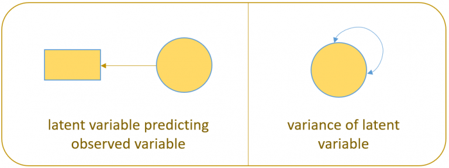

```{r setup, include=FALSE}
knitr::opts_chunk$set(echo = TRUE)
```

### Introduction

**These are notes to accompany the video 'Introduction to Structural Equation Modeling'  by Johnny Lin (https://www.youtube.com/watch?v=sKVFkVoYfbs). Where text has been directly copied from the course materials these are denoted by the initials '[JL]'.**

[JL] Structural equation modeling is a linear model framework that models both simultaneous regression equations with latent variables.  Models such as linear regression, multivariate regression, path analysis, confirmatory factor analysis, and structural regression can be thought of as special cases of SEM. The following relationships are possible in SEM:

* observed to observed variables (, e.g., regression)
* latent to observed variables (, e.g., confirmatory factor analysis)
* latent to latent variables ( e.g., structural regression)

---

#### Exercise

Suppose you are a researcher studying the effects of student background on academic achievement. The lab recently finished collecting and uploading the dataset (`worland5.csv`) of $N = 500$students each with 9 observed variables: Motivation, Harmony, Stability, Negative Parental Psychology, SES, Verbal IQ, Reading, Arithmetic and Spelling. The principal investigator hypothesizes three latent constructs Adjustment, Risk, Achievement measured with its corresponding to the following codebook mapping:

Adjustment

* `motiv` Motivation
* `harm` Harmony
* `stabi` Stability

Risk

* `ppsych` (Negative) Parental Psychology
* `ses` SES
* `verbal` Verbal IQ

Achievement

* `read` Reading
* `arith` Arithmetic
* `spell` Spelling

---

#### Exploring the data

```{r, include=TRUE}
dat <- read.csv("https://stats.idre.ucla.edu/wp-content/uploads/2021/02/worland5.csv")
```

[JL] The most essential component of a structural equation model is **covariance** or the statistical relationship between items. The true population covariance, denoted $\Sigma$, is called the **variance-covariance matrix**. Since we do not know $\Sigma$ we can estimate it with our sample, and call it $\hat{\Sigma} = S$ or the **sample variance-covariance matrix**. The function `cov` specifies that we want to obtain the covariance matrix $S$ from the data.

```{r}
cov(dat)
```

#### Definitions

* **observed variable**: a variable that exists in the data, a.k.a item or manifest variable
* **latent variable**: a variable that is constructed and does not exist in the data
* **exogenous variable**: an independent variable either observed ($x$) or latent ($\xi$) that explains an endogenous variable
* **endogenous variable**: a dependent variable, either observed ($y$) or latent ($\eta$) that has a causal path leading to it
* **measurement model**: a model that links observed variables with latent variables
* **indicator**: an observed variable in a measurement model (can be exogenous or endogenous)
* **factor**: a latent variable defined by its indicators (can be exogenous or endogenous)
* **loading**: a path between an indicator and a factor
* **structural model**: a model that specifies causal relationships among exogenous variables to endogenous variables (can be observed or latent)
* **regression path**: a path between exogenous and endogenous variables (can be observed or latent)

#### The path diagram

{width=30%}

{width=50%}


Format: LISREL
N.B. lavaan does not use LISREL notation

#### Quick reference of lavaan syntax

* `~` predict, used for regression of observed outcome to observed predictors (e.g., $y ~ x$)
* `=~` indicator, used for latent variable to observed indicator in factor analysis measurement models (e.g., `f =~ q + r + s`)
* `~~` covariance (e.g., x ~~ x)
* `~1` intercept or mean (e.g., x ~ 1 estimates the mean of variable x)
* `1*` fixes parameter or loading to one (e.g., f =~ 1*q)
* `NA*` frees parameter or loading (useful to override default marker method, (e.g., f =~ NA*q)
* `a*` labels the parameter ‘a’, used for model constraints (e.g., f =~ a*q)

